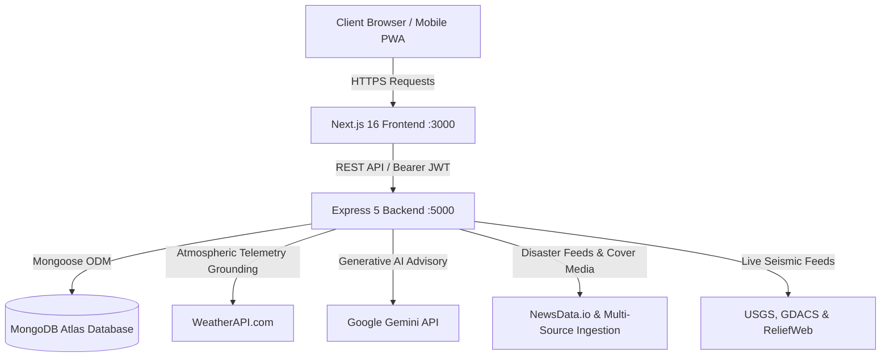

# WeatherWise (Weather-AI)

<div align="center">


[](https://nextjs.org/)
[](https://react.dev/)
[](https://ai.google.dev/)
[](https://nodejs.org/)
[](https://www.mongodb.com/)
[](https://tailwindcss.com/)
[](https://threejs.org/)

**Stay Informed. Stay Safer.**  
A modern, AI-powered atmospheric intelligence platform providing real-time weather telemetry, natural disaster news feeds with integrated cover imagery, 3D interactive satellite globes, and multilingual meteorological AI consultations powered by Google Gemini.

[Key Features](#key-features) • [Tech Stack](#tech-stack) • [Architecture](#architecture) • [Getting Started](#getting-started) • [Environment Variables](#environment-variables) • [API Reference](#api-reference) • [Project Structure](#project-structure)

</div>

---

## 🌟 Key Features

### 1. 🌦️ Real-Time Atmospheric Telemetry
* **Hyperlocal Current Weather**: Real-time tracking of temperature, feels-like, wind speed & direction, pressure, humidity, dew point, visibility, and UV index.
* **Forecast Horizons**: Interactive 24-hour hourly slider and comprehensive 7-day extended forecasts.
* **Air Quality Index (AQI)**: Accurate breakdown of PM2.5, PM10, Ozone ($O_3$), Nitrogen Dioxide ($NO_2$), and Carbon Monoxide ($CO$) with health safety ratings.
* **Sun & Moon Telemetry**: Precise astronomical tracking of sunrise, sunset, moonrise, moonset, and lunar phase progression.

### 2. 🚨 Natural Hazard & Disaster Alert Feeds
* **Integrated Disaster Cover Imagery**: Dynamic high-resolution cover photos with automated contextual fallbacks across 11+ disaster types (*Earthquake, Flood, Cyclone, Hurricane, Tsunami, Wildfire, Landslide, Volcano, Tornado, Drought, Storm*).
* **Multi-Source Crisis Ingestion**: Aggregates emergency data from USGS Earthquake Hazards, GDACS (Global Disaster Alert & Coordination System), ReliefWeb, and NewsData.io.
* **Severity & Trending Classifications**: Intelligent badge indicators (`Red Alert / Danger`, `Orange Alert / Warning`, `Advisory / Info`) and trending disaster detection.
* **Category Filters**: Instant filtering by disaster type (`All`, `Earthquake`, `Flood`, `Wildfire`, `Storm`, etc.) with responsive mobile drawer controls.

### 3. 🤖 AI Weather Consultation Chatbot (Google Gemini)
* **Context-Aware Meteorological Grounding**: Automatically detects locations in user conversations, fetches real-time telemetry from WeatherAPI, and provides proactive advice on clothing, travel safety, and outdoor activities.
* **Multilingual AI Support**: Seamlessly converses across 7 languages (**English, Hindi, Kannada, Spanish, French, German, Japanese**) with localized greetings and starter suggestions.
* **Resilient Model Fallbacks**: Configured with primary `gemini-3.6-flash` and automatic failover to `gemini-3.5-flash-lite` and `gemini-3.7-flash`.
* **Persistent Conversation History**: Multi-turn chat sessions and historical consultations saved securely to MongoDB per user.

### 4. 🌍 3D Realistic Weather Globe & 2D Live Doppler Radar
* **Interactive 3D WebGL Globe**: Built with Three.js and React Three Fiber featuring realistic atmospheric glow, city pin markers, and real-time hover tooltips.
* **2D Live Doppler Radar Map**: High-resolution interactive Leaflet radar supporting Temperature, Precipitation, Wind Speed, and Cloud Coverage tile layers.
* **Expandable Viewport**: Smooth one-click toggle between compact card mode and expansive full-screen inspection.

### 5. 📍 Fast Location Search & Bookmarking
* **Zero-Latency Instant Autocomplete**: Built-in 0ms local city database matching paired with debounced worldwide geocoding, eliminating cascading re-render overhead.
* **Favorites System**: Bookmark cities organized under custom tags (`Home`, `Work`, `Travel`, `Other`).
* **GPS Auto-Detect**: One-tap browser geolocation to fetch local telemetry instantly.

### 6. 📱 Responsive & Mobile-First Design
* **Optimized Mobile Views**: Specialized high-density card layouts, compact dialogs, bottom navigation bars, and mobile drawers designed specifically for `< 640px` screens.
* **Glassmorphism UI**: High-contrast, accessibility-tested dark/light theme switching with smooth transitions and subtle micro-animations.

---

## 🛠️ Tech Stack

### Frontend (`w-frontend`)
| Technology | Description |
| :--- | :--- |
| **Next.js 16 (App Router)** | Server & client hybrid framework with Turbopack compilation |
| **React 19** | Modern declarative UI component library |
| **Tailwind CSS v4** | Utility-first styling with modern CSS variables |
| **Three.js & @react-three/fiber** | WebGL 3D photorealistic globe rendering |
| **Leaflet & React-Leaflet** | Interactive 2D satellite and meteorological radar maps |
| **Lucide React** | Consistent, lightweight modern icon system |
| **Motion** | Fluid micro-interactions and smooth layout transitions |

### Backend (`w-backend`)
| Technology | Description |
| :--- | :--- |
| **Node.js & Express 5** | REST API server with modular routing and global error handling |
| **Google Gemini API** | Advanced generative AI for context-aware weather consultation |
| **MongoDB & Mongoose 9** | Cloud database persistence with structured data schemas |
| **JWT & bcryptjs** | Secure stateless authentication and salted password hashing |
| **CORS & Dotenv** | Cross-origin resource sharing and environment management |

### External APIs & Data Sources
* **[Google Gemini API](https://ai.google.dev/)**: Contextual atmospheric chatbot and safety advisories.
* **[WeatherAPI.com](https://www.weatherapi.com/)**: Hyperlocal current weather, 7-day forecasts, and astronomical data.
* **[NewsData.io](https://newsdata.io/)**: Real-time crisis and disaster news ingestion.
* **[USGS Earthquakes](https://earthquake.usgs.gov/)**: Global seismic activity and earthquake feeds.
* **[GDACS](https://www.gdacs.org/)**: Global Disaster Alert and Coordination System feeds.
* **[ReliefWeb](https://reliefweb.int/)**: Humanitarian crisis updates and disaster reports.

---

## 🏗️ Architecture



---

## 🚀 Getting Started

### Prerequisites
* **Node.js**: `v18.0.0` or higher
* **npm**, **yarn**, or **pnpm**
* **MongoDB**: A free MongoDB Atlas cluster URI or local MongoDB instance

---

### 1. Clone the Repository
```bash
git clone https://github.com/likithsurya23/Weather-AI.git
cd Weather-AI
```

---

### 2. Backend Setup
1. Navigate to the backend directory:
   ```bash
   cd w-backend
   ```
2. Install dependencies:
   ```bash
   npm install
   ```
3. Create a `.env` file in the `w-backend` directory:
   ```env
   PORT=5000
   NODE_ENV=development
   CLIENT_URL=http://localhost:3000
   JWT_SECRET=your_jwt_secret_key
   MONGODB_URI=mongodb+srv://<username>:<password>@<cluster>.mongodb.net/weatherai?retryWrites=true&w=majority
   WEATHER_API_KEY=your_weatherapi_key
   GEMINI_API_KEY=your_google_gemini_api_key
   GEMINI_MODEL=gemini-3.6-flash
   NEWSDATA_API_KEY=your_newsdata_api_key
   ```
4. Start the backend server:
   ```bash
   npm run dev
   # or
   npm start
   ```
   *The server will run at `http://localhost:5000` with connected MongoDB status.*

---

### 3. Frontend Setup
1. Open a new terminal and navigate to the frontend directory:
   ```bash
   cd w-frontend
   ```
2. Install dependencies:
   ```bash
   npm install
   ```
3. Create a `.env.local` file in the `w-frontend` directory:
   ```env
   NEXT_PUBLIC_API_BASE=http://localhost:5000/api
   NEXT_PUBLIC_WEATHER_API_KEY=your_weatherapi_key
   NEXT_PUBLIC_NEWSDATA_API_KEY=your_newsdata_api_key
   ```
4. Start the Next.js development server:
   ```bash
   npm run dev
   ```
   *The frontend will launch at `http://localhost:3000`.*

---

## 🔐 Environment Variables

### Backend (`w-backend/.env`)
| Variable | Description | Required |
| :--- | :--- | :---: |
| `PORT` | Port for Express server (default: `5000`) | No |
| `NODE_ENV` | Environment mode (`development` / `production`) | No |
| `CLIENT_URL` | Allowed frontend origin for CORS | No |
| `JWT_SECRET` | Secret key for signing and verifying JWT tokens | **Yes** |
| `MONGODB_URI` | MongoDB connection string (Atlas or local) | **Yes** |
| `WEATHER_API_KEY` | API key from [WeatherAPI.com](https://www.weatherapi.com/) | **Yes** |
| `GEMINI_API_KEY` | API key from [Google AI Studio](https://aistudio.google.com/) | **Yes** |
| `GEMINI_MODEL` | Gemini model name (default: `gemini-3.6-flash`) | No |
| `NEWSDATA_API_KEY` | API key from [NewsData.io](https://newsdata.io/) | No |

### Frontend (`w-frontend/.env.local`)
| Variable | Description | Required |
| :--- | :--- | :---: |
| `NEXT_PUBLIC_API_BASE` | Base URL of the backend API (`http://localhost:5000/api`) | **Yes** |
| `NEXT_PUBLIC_WEATHER_API_KEY` | WeatherAPI public key for direct client utilities | **Yes** |
| `NEXT_PUBLIC_NEWSDATA_API_KEY` | NewsData key for client-side fallbacks | No |

---

## 📡 API Reference

### Health Check
* `GET /api/health` — Checks API service status and uptime.

### Authentication (`/api/auth`)
* `POST /api/auth/register` — Register a new account (`name`, `email`, `password`).
* `POST /api/auth/login` — Authenticate and receive a JWT token.
* `GET /api/auth/me` — Retrieve current authenticated user profile *(Requires Bearer Token)*.

### Weather Telemetry (`/api/weather`)
* `GET /api/weather/current?city={cityName}` — Real-time atmospheric metrics.
* `GET /api/weather/forecast?city={cityName}&days=7` — Extended hourly and 7-day forecast.
* `GET /api/weather/search?q={query}` — Location autocomplete and geocoding search.

### Natural Hazards & Disaster Alerts (`/api/alerts`)
* `GET /api/alerts/disaster-news` — Aggregated crisis news with integrated cover images, category classification, and severity ratings.
* `GET /api/alerts` — Active weather alerts for current or bookmarked locations.
* `POST /api/alerts/:id/dismiss` — Dismiss an alert notification.
* `PUT /api/alerts/settings` — Update severity threshold preferences *(Requires Bearer Token)*.

### AI Chatbot Consultant (`/api/chat`)
* `POST /api/chat/ask` — Submit questions to the Gemini weather AI consultant with atmospheric telemetry grounding.
* `GET /api/chat/history?language={lang}` — Retrieve past consultation history with localized greetings and starter prompts.
* `DELETE /api/chat/history` — Clear conversation history.

### Favorites (`/api/favorites`)
* `GET /api/favorites` — Fetch all bookmarked locations for the authenticated user.
* `POST /api/favorites` — Save a new location bookmark with optional category tag (`Home`, `Work`, `Travel`, `Other`).
* `DELETE /api/favorites/:id` — Remove a bookmarked location.

### User Settings & Profile (`/api/user`)
* `PUT /api/user/profile` — Update user name, email, or avatar.
* `PUT /api/user/preferences` — Save notification, unit, and language preferences.
* `DELETE /api/user/account` — Permanently delete user account and associated data.

---

## 📂 Project Structure

```text
Weather-AI/
├── w-backend/                  # Express.js Backend Service
│   ├── config/                 # Database & environment configurations
│   │   └── db.js               # MongoDB connection handler
│   ├── controller/             # Business logic controllers
│   │   ├── alertsController.js # Weather advisory handling
│   │   ├── authController.js   # JWT authentication & registration
│   │   ├── chatController.js   # AI chatbot orchestration & history
│   │   ├── favoritesController.js # Bookmarking & categories
│   │   ├── newsController.js   # Disaster news aggregation & cover images
│   │   ├── userController.js   # Profile & preferences management
│   │   └── weatherController.js# Telemetry caching & normalization
│   ├── middleware/             # Express middlewares (JWT Auth, Error handler)
│   │   ├── authMiddleware.js
│   │   └── errorHandler.js
│   ├── models/                 # Mongoose schemas
│   │   ├── Alert.js
│   │   ├── ChatHistory.js
│   │   ├── Favorite.js
│   │   └── User.js
│   ├── routers/                # Express API routes
│   │   ├── alertsRouter.js
│   │   ├── authRouter.js
│   │   ├── chatRouter.js
│   │   ├── favoritesRouter.js
│   │   ├── userRouter.js
│   │   └── weatherRouter.js
│   ├── services/               # Core internal services
│   │   ├── authService.js      # Password hashing & JWT signing
│   │   └── geminiService.js    # Google Gemini AI prompts & multilingual logic
│   ├── package.json
│   └── server.js               # Application entry point
│
├── w-frontend/                 # Next.js 16 Frontend App
│   ├── app/                    # App Router Pages
│   │   ├── alerts/             # Disaster news & severe weather alerts
│   │   ├── chat/               # Multilingual Weather AI Chat consultant
│   │   ├── dashboard/          # Comprehensive weather dashboard & telemetry
│   │   ├── favorites/          # Saved cities & categories
│   │   ├── login/              # Authentication login screen
│   │   ├── map/                # 3D Globe & 2D Live Radar viewer
│   │   ├── profile/            # User profile & account security
│   │   ├── search/             # Global location search
│   │   ├── settings/           # Location, notification, language settings
│   │   ├── signup/             # Account creation screen
│   │   ├── layout.jsx          # Root layout with providers
│   │   └── page.jsx            # Public landing page
│   ├── src/
│   │   ├── components/
│   │   │   ├── auth/           # ProtectedRoute wrapper
│   │   │   ├── chat/           # Chatbot message views & speech UI
│   │   │   ├── layout/         # TopNavbar, Sidebar, PublicNavbar
│   │   │   ├── map/            # WeatherGlobe, WeatherMapViewer, LeafletMap
│   │   │   └── ui/             # 3D-globe WebGL canvas & UI primitives
│   │   ├── Hooks/
│   │   │   └── useAppContext.jsx # Global state, auth, language, weather context
│   │   └── lib/
│   │       ├── api.js          # API client with token management
│   │       ├── citiesData.js   # Fast offline cities database for 0ms autocomplete
│   │       ├── disasterClassifier.js # Incident classification & cover assets
│   │       ├── translations.js # Multilingual dictionary for 7 languages
│   │       └── weatherUtils.js # Meteorological units and formatters
│   ├── package.json
│   └── next.config.mjs
│
└── README.md                   # Root Project Documentation
```

---

## 🛡️ License

This project is licensed under the [MIT License](LICENSE).

---

<div align="center">
Made with ❤️ for atmospheric intelligence & public disaster safety.
</div>